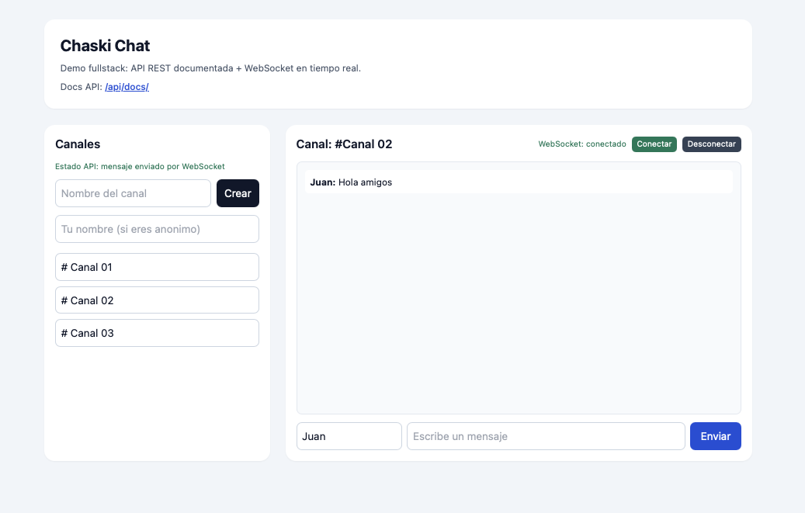
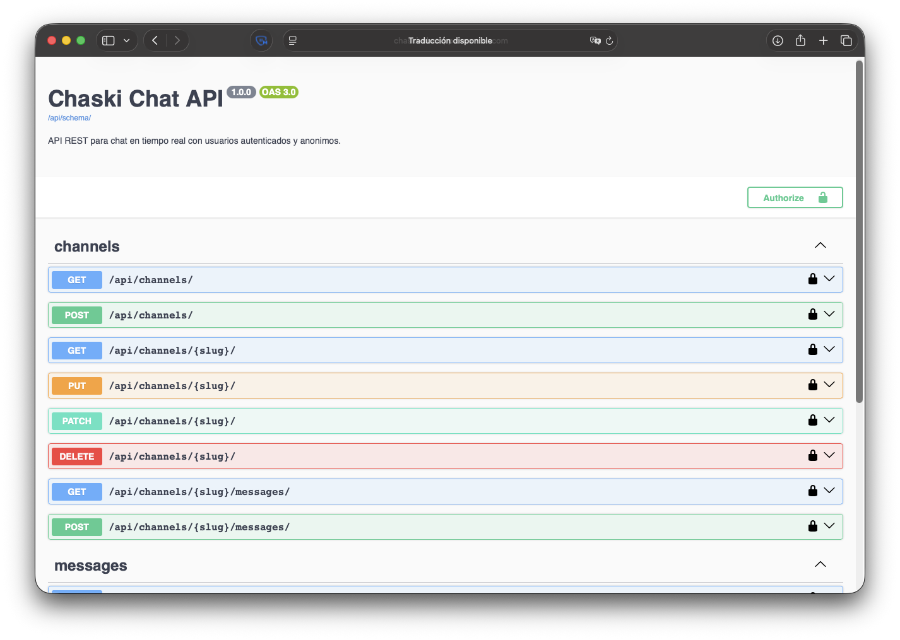

# Chaski

Aplicación de mensajería en tiempo real inspirada en los mensajeros del imperio inca.

Permite crear canales y enviar mensajes instantáneamente utilizando WebSockets, demostrando comunicación en tiempo real desde el backend con Django Channels y una API REST documentada.

---

## 🚀 Demo

- Live demo: https://chaski-chatapp.onrender.com/
- Swagger: https://chaski-chatapp.onrender.com/api/docs/
- ReDoc: https://chaski-chatapp.onrender.com/api/redoc/
- Schema OpenAPI: https://chaski-chatapp.onrender.com/api/schema/

---

## 🖼️ Capturas

---

## 🧩 Retos técnicos

- Manejo de conexiones WebSocket concurrentes
- Integración de Django Channels con Redis
- Sincronización de mensajes en tiempo real entre múltiples clientes
- Soporte híbrido de usuarios autenticados y anónimos

---





---

## ✨ Características principales

- Chat en tiempo real con WebSockets (Django Channels)
- API REST completa para canales y mensajes
- Documentación automática con OpenAPI (Swagger + ReDoc)
- Soporte para usuarios autenticados y anónimos
- Persistencia de mensajes en base de datos
- Frontend simple para demostración rápida

---

## 🛠️ Stack técnico

**Backend**
- Django 6
- Django REST Framework
- Django Channels
- Daphne (ASGI server)

**Documentación**
- DRF Spectacular (OpenAPI 3)

**Base de datos**
- SQLite (desarrollo)

**Frontend**
- Django Templates
- Tailwind CSS (CDN)

---

## ⚙️ Arquitectura (resumen)

- `apps/chat/models.py`: modelos de canales y mensajes  
- `apps/chat/views.py`: API REST (ViewSets)  
- `apps/chat/consumers.py`: lógica WebSocket  
- `config/asgi.py`: configuración ASGI + Channels  
- `config/routing.py`: rutas de WebSocket  
- `templates/`: interfaz básica para demo  

---

## 🔌 API REST

### Canales

- `GET /api/channels/` → listar canales  
- `POST /api/channels/` → crear canal  
- `GET /api/channels/{slug}/` → detalle de canal  

### Mensajes

- `GET /api/channels/{slug}/messages/` → mensajes de un canal  
- `POST /api/channels/{slug}/messages/` → enviar mensaje  
- `GET /api/messages/` → listado global  
- `GET /api/messages/{id}/` → detalle  

---

## ⚡ WebSocket

- URL:
```
ws://127.0.0.1:8000/ws/chat/{slug}/
```

### Payload esperado

```json
{
  "content": "Hola equipo",
  "nickname": "visitante"
}
```

### Flujo

1. El cliente se conecta al WebSocket del canal  
2. Envía un mensaje en formato JSON  
3. El servidor:
   - procesa el mensaje  
   - lo guarda en base de datos (si aplica)  
   - lo transmite a todos los clientes conectados  
4. Los usuarios reciben el mensaje en tiempo real  

---

## 🔐 Autenticación

La aplicación soporta dos modos de uso:

### Usuario autenticado
- Mensajes asociados a un usuario real  
- Uso de session auth o basic auth  

### Usuario anónimo
- Requiere `nickname` para enviar mensajes  
- `created_by_name` para identificar creador del canal  

---

## 🧪 Tests

Incluye pruebas base para:

- Creación anónima de canales  
- Publicación de mensajes con nickname  

Ejecutar:

```bash
source .venv/bin/activate
python manage.py test
```

---

## 🖥️ Ejecutar en local

```bash
python3 -m venv .venv
source .venv/bin/activate
pip install -r requirements.txt
python manage.py migrate
python manage.py runserver
```

---

## ☁️ Deploy en Render

Este repo ya incluye [render.yaml](render.yaml) para desplegar con Blueprint.

### Pasos

1. Sube el repo a GitHub.
2. En Render, selecciona `New` → `Blueprint`.
3. Conecta el repositorio y Render leerá `render.yaml`.
4. Espera que se creen:
  - Web service (Django + Daphne)
  - Redis (Channels)
5. Abre la URL del servicio web y prueba `/api/docs/`.

### Variables importantes

- `SECRET_KEY`: se genera automáticamente
- `DEBUG=false`
- `ALLOWED_HOSTS=.onrender.com`
- `REDIS_URL`: enlazada a Redis de Render

### Base de datos

El deploy queda usando solo SQLite, como pediste.

- Si Render reinicia o redeploya, el archivo SQLite puede perderse porque el filesystem es efímero.
- Si quieres persistencia real con SQLite en Render, hay que añadir un disk persistente.
- Para un chat de demo/portafolio, SQLite sirve bien mientras no necesites guardar histórico entre redeploys.

### Nota sobre WebSockets

Para producción, Channels usa Redis automáticamente si existe `REDIS_URL`. Si no existe, cae a `InMemoryChannelLayer` (solo útil para desarrollo local).

---

## 📌 Roadmap

- [ ] Indicador de usuario escribiendo  
- [ ] Estado online/offline  
- [ ] Notificaciones en tiempo real  
- [ ] Mejoras en UI  
- [ ] Soporte para mensajes privados (1 a 1)  

---

## 🧠 Notas

Chaski toma su nombre de los mensajeros del imperio inca, conocidos por transmitir información de forma rápida a través de largas distancias.

Este proyecto busca reflejar esa idea mediante comunicación en tiempo real usando tecnologías modernas.